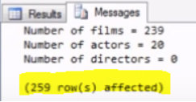
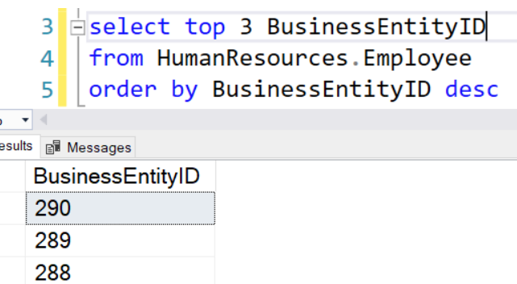

<h4 align="center">FCIM UTM </h4>
<h1 align='center'> 

▒▐█▀▄░▒▐█▀█▄  
▒▐█▀▀▄▒▐█▌▐█  
▒▐█▄▄▀▒▐█▄█▀ 

</h1>
<h4 align="center">Technical University of Moldova  </h4>
<h4 align="center">FCIM   |   UTM   |   Spring 2022</h4>

                           
  

 
  
p. Galcenco Boris

 
  
Chisinau 2022

  

---

-- Intro Database –

|  
Questions
      | Answers |
| -------------  | --- |
|1. What is database purpose? | Store and manage data.|
|2. When did the Database concepts born? | Thousands of year ago, the Egyptians first ( store and preserve date, curve it into stone).|
|3. How the data gets generated? | We generate manual data, or automatically.|
|4. Who consumes the data? | Applications (software) or/and people.
|5. What for is data being consumed? | Apps/Users|
|6. Databases are used to....  | apps ( efficiently store data and return it when requested)|
|7. What is DBMS? | Database Management Systems|
|8. What is the SQL? | Structured Query Language|
|9. What are the data use cases (1.. 2.. 3.. ) | directly and indirectly, 1) writing and executing queries against data in database, 2)executing searches, or submit/save button, generating a sequence statement to retrieve that date, 3)business/organizations|
|10. Which "hats" you wear when working with data? | backend dev, data analysis, scientist, engineer, data researcher|
|11. Since when the SQL is around here? (19..) | 1974|

|  
Questions
      | Answers |
| -------------  | --- |
|1. In what order do records appear when executing a SQL query without ORDER BY clause? | no particular order, in order they were added to database
|2. What is the default order for ORDER BY clause? | ASC
|3. Can fields which were not mentioned in the SELECT list be used in the ORDER BY clause? | Yes
|4. Can fields which were not mentioned in the SELECT list be used in the ORDER BY clause? | Yes
|5.as in example, the "top" instruction shows only x mentioned enteties, the "with ties" allow to show more if some of them have the same data|
|6. Can WHERE clause be applied after ORDER BY clause?| No
|7. Will "ID BETWEEN 10 AND 100" statement  return records with ID equal to 10 or 100? | Yes
|8. Is filtering by text data case sensitive? E.g. WHERE Name = 'Ion' |Case insensitive
|9. List the wildcards you've learned and explain their functionality | [ % ]	Represents zero or more characters	 [ _ ]	Represents a single character	 [ [] ]	Represents any single character within the brackets	 [ ^ ]	Represents any character not in the brackets  [ - ]	Represents any single character within the specified range	
|10. What is the default masks for Date formats in MS SQL? (choose 2 out of 4) |'MM/DD/YYYY'

  

# Laboratory work #3 
<h2 align="center">(Functions in queries)</h2> 

 https://www.youtube.com/watch?v=Fm8od9L9HMg
 

|  
Questions
      | Answers |
| -------------  | --- |
| Each and every function in MS SQL requires at least 1 parameter |False
| What will be the correct version of get current date function call? | SELECT GETDATE()
|Can a result of one function be used as a parameter of another function? | Yes

<h2 align="center">(Text calculations)</h2> 

https://www.youtube.com/watch?v=HJKraiIoYPU
 

|  
Questions
      | Answers |
| -------------  | --- |
|What is (are) the correct syntax of concatenate function in MS SQL? | [+] and [CONCAT()]
|Do CAST() and CONVERT() functions behave similarly in MS SQL? | (not answered)variants: Yes/No
|You have a table:  

&nbsp;&nbsp;&nbsp;SELECT ActorName 
&nbsp;&nbsp;&nbsp;FROM ( 
	&nbsp;&nbsp;&nbsp;&nbsp;&nbsp;&nbsp;&nbsp;&nbsp;SELECT 'Tom BigBoy Cruise' as ActorName 
	&nbsp;&nbsp;&nbsp;&nbsp;&nbsp;&nbsp;&nbsp;&nbsp;UNION 
	&nbsp;&nbsp;&nbsp;&nbsp;&nbsp;&nbsp;&nbsp;&nbsp;SELECT 'Dwayne Rock Johnson' as ActorName 
&nbsp;&nbsp;&nbsp;) A; 

 
&nbsp;&nbsp;&nbsp;&nbsp;&nbsp;Using substring() function instead of right() and left(), write a SQL query which will show the First Name and Last Name only in single field. As an answer please provide a complete SQL query (without any additional text)

&nbsp;&nbsp;&nbsp;&nbsp;&nbsp;So in our case, expected output is:

&nbsp;&nbsp;&nbsp;&nbsp;&nbsp;&nbsp;&nbsp;&nbsp;&nbsp;Tom Cruise 
&nbsp;&nbsp;&nbsp;&nbsp;&nbsp;&nbsp;&nbsp;&nbsp;&nbsp;Dwayne Johnson 

-

 
<h2 align="center">(Date Calculations)</h2> 

https://www.youtube.com/watch?v=Q2xhAafpRJo
 

- Try it yourself in DB and answer: what will happen if you will wrongly specify less number of chars than required by date mask?

&nbsp;&nbsp;&nbsp;&nbsp;&nbsp;For example: 
      convert(char(8), SomeDateField, 103)

&nbsp;&nbsp;&nbsp;&nbsp;&nbsp;When 103 date style requires 10 symbols?

2008-06-01 00:00:00.000 --- > 01/06/20

- Try it yourself in DB and answer: what will happen if you will specify more number of chars than required by date mask?

&nbsp;&nbsp;&nbsp;&nbsp;&nbsp;For example:
      convert(char(10), SomeDateField, 3)

When 3 date style requires 8 symbols?
*
Write a query to select a month from the RegistryDate field
*
Considering that we have the following field with a single row:

select CAST('2024-09-26 00:00:00.000' AS DATETIME) as FutureModifiedDate

- What will be the output of the following function call?

DATEDIFF(YY, FutureModifiedDate, GETDATE())
*
2
-2
  
# Laboratory work #4
 
<h2 align="center">(Group By and Having)</h2> 

https://www.youtube.com/watch?v=oWkvHodS9cA
 

Which function does not belong to the same group as others?
*
MIN()
COUNT()
ROUND()
AVG()
Look at the query below. Is it a valid one?

SELECT GroupName, AVG(Mark), COUNT(*)
FROM Students
GROUP BY GroupName;
*
Yes
No
Look at the query below. Is it a valid one?

SELECT GroupName, AVG(Mark), COUNT(*)
FROM Students
ORDER BY GroupName
GROUP BY GroupName;
*
Yes
No
What is the difference between GROUP BY and GROUP BY WITH ROLLUP?
*
How behaves GROUP BY WIH ROLLUP if you are grouping by two or more fields?
*
What is the difference between WHERE and HAVING clauses?
*
Using Address and CustomerAddress tables from AdventureWorksLT2019 database, write a query that:

Calculates a count of records under  each separate [Address.CountryRegion] and [CustomerAddress.AddressType] fields combination. The query should not return row if the count is greater than 100. It should also take only the records with non-NULL values in [Address.AddressLine2] field.

Please provide the whole query as the answer
*
Captionless Image

  
# Laboratory work #4
 

Table HumanResources.Employee from AdventureWorks2019 database contains a field called LoginID. It is filled with the data using the pattern [db_name]\[username] as shown at the screenshot below.
Write a query which returns usernames only (data after "\" symbol) as shown at highlighted part of the screenshot

Please provide the whole query as the answer

USE AdventureWorks2019
SELECT RIGHT(LoginID,len(LoginID)-CHARINDEX('\',LoginID )) AS LoginID FROM HumanResources.Employee

  
Check the content of Person.Person, Person.PersonPhone and Person.PhoneNumberType tables from  AdventureWorks2019 database.

Write a query that shows each person's First Name, Last Name, Phone Number, but only for the recors with "Employee" Person Type and "Work" Phone Type (please do not "hardcode" the phone type, use subquery or join instead)

Please provide the whole query as the answer
*
Prerequisite: run the following query in the AdventureWorks2019 database connection script:

delete from Person.EmailAddress where BusinessEntityID between 286 and 298;

Then using tables Person.Person and Person.EmailAddress write a query which will show all the fields from the Person table only for the entries which does not have an email set up in EmailAddress table.

Please provide the whole query as the answer
*
Prerequisite: run the following query in AdventureWorks2019 database :

Update HumanResources.JobCandidate set BusinessEntityID = 212 where jobCandidateId = 6;

Table HumanResources.JobCandidate contains info about candidates. Entries with non-NULL BusinessEntityID field already have an interviewer assigned - this BusinessEntityID represents interviewer's ID.

So, using the following tables:

HumanResources.JobCandidate
HumanResources.Employee
Person.Person
Person.PersonPhone
Person.PhoneNumberType

Write a query which returns info about all currently assigned  interviewers in JobCandidate table: their FirstName and LastName, and a PhoneNumber if the type of PhoneNumber is "Work"; if it's not "Work" - default Phone Number to '8-800-555-35-35'
Info about the same interviewer should appear only ONCE.

Please provide the whole query as the answer
*
Captionless Image
This excercise uses AdventureWorksLT2019 database, not AdventureWorks2019 - be careful

Write a query which will show all Customer FN/LN from table Customers and their respective Address ID's from table CustomerAddress. In case if there's more than one address for a particluar customer in the CustomerAddress table, choose the record with AddressType = 'Main Office'. Result dataset should contain only 1 row for each Customer.

Don't be shy to use subqueries.

Please provide the whole query as the answer 

   

# Laboratory work #6
<h2 align="center">(SP basics)</h2> 

 https://www.youtube.com/watch?v=fjNsRV4zLdc
</>
<h2 align="center">(
SP with parameters)</h2> 

 https://www.youtube.com/watch?v=Vs-atxMs4mw
</>

|  
Questions
      | Answers |
| -------------  | --- |
|What is obligatory for a SP creation?|????? BEGIN and END reserved words Mark a batch start with GO reserved word Provide a name to the SP 
|What is the correct syntax to execute getFirstName procedure?|????? SELECT getFirstName EXECUTE getFirstName RUN getFirstName 
|What should be used in case is you want to change the code of SP?
|What should be used in case is you want to delete the SP?
|Assuming that you have the following procedure (you can try to create it in AdventuryWorks2019 database):  CREATE PROC getProduct AS SELECT * FROM Production.Product WHERE SafetyStockLevel >= 100;  Modify it: is should receive as a perameter the min value of SafetyStockLevel (instead of hardcoding it to 100)  Please provide the whole SQL query as an answer
|Considering that @Name - is a parameter of any SP, what is the correct way to apply this parameter to any hardcoded string?|
????? '@Name is a student' @Name + ' is a student'
|What should you use if you need to specify a default value for any of SP parameter? 
|Check the content of Production.ProductListPriceHistory and Production.Product tables from  AdventureWorks2019 database.  Write a SP that: takes as a parameter @countNumber; returns all the ProductIDs, product Names, count of occurencies and maximum value of ListPrice for all the products that appear in ProductListPriceHistory table @countNumber times.  Please provide the whole SQL query as an answer |

   

# Laboratory work #7 
<h2 align="center">(Variables)</h2> 

 https://www.youtube.com/watch?v=NmYaOlcbfZM
</>
<h2 align="center">(
Output Parameters & Return Values</h2> 

 https://www.youtube.com/watch?v=GvRv4V-AK70
</>

|  
Questions
      | Answers |
| -------------  | --- |
|The query below returns top 4 records from table Employee (AdventureWorks2019 database)  SELECT TOP 4 * FROM HumanResources.Employee;  Please add a parameter @Num which can be used instead of hardcoded value and check that the query works in a database.  Hint: most probably just raplacing 4 with @Num will not work  Please provide the whole query as the answer.
|Can we use a subquery in order to assign an initial value to the variable just in DECLARE statement? Please check in DB|?????Yes/No
|What function can be used in case if you want to show some text output in the "Messages" tab of the script output window?|
|How can you suppress the default message about how much rows have been affected by the query in the "Messages" tab of the script output window?  
|Look at the query and it's output at the screenshot below.  How do you think, what will happen if we'll try to assign the output of this query to a single variable of type int as in the script below?  DECLARE @test AS INT  SELECT TOP 3 @test = BusinessEntityID FROM HumanResources.Employee ORDER BY BusinessEntityID DES |?????  Error appears - the script is invalid to be run It will assign the value 290 to the variable It will assign the value 288 to the variable
|At the previous work #6 we've created a Stored Procedure which returns some select output - you can double check it on https://docs.google.com/forms/d/1Fzqykk-BZvS1I3X417xWtGRzO4Z1L4DuN-PkleCLCdE/   Now, please create a new one proc which actually soes the same but in another format:  - takes as a parameter @countNumber; - returns you as output parameter the set of ProductId values in a single concatenated string - values should be separated by comma for the products that appear in ProductListPriceHistory table @countNumber times - returns you as output parameter the number of rows affected  These two output parameters must be accessable outside of SP after it's invocation Please see the example at the screenshot below: 

  
# Laboratory work #7 
<h2 align="center">(CTEs)</h2> 

 https://www.youtube.com/watch?v=U0wXjUi2v_U
</>
<h2 align="center">(Cursors)</h2> 

 https://www.youtube.com/watch?v=RHRjLd0bEaQ
</>

|  
Questions
      | Answers |
| -------------  | --- |
|Check the following CTE list. Is it a valid one? If no, whatshould we change to make it work?  WITH TABLE1 AS ( SELECT Name, Surname FROM SomeTable WHERE Name LIKE'A%' ), TABLE2 AS ( SELECT * FROM TABLE1 JOIN TABLE3 0N TABLE1.SURNAME = TABLE3.SURNAME ), TABLE3 AS ( SELECT Name, Surname FROM TABLE2 WHERE Name LIKE 'B%' ) SELECT * FROM TABLE2;|The CTE, we can’t use the select statement if we did not created the table, as in line 8 table3 was not initialized…,also… The “0N TABLE1.S….” in “o”, because it’s a misstype |
|Run the following DDL statement as a prerequisite:

CREATE TABLE EmployeeJournal
(NationalIDNumber NVARCHAR(MAX) NOT NULL,
JobTitle NVARCHAR(MAX) NOT NULL,
BirthDate date NOT NULL,
AnniversaryFlag NVARCHAR(1) NOT NULL,
FirstName NVARCHAR(MAX) NOT NULL,
LastName NVARCHAR(MAX) NOT NULL,
ThreadNumber INT NOT NULL,
EntryDatetime DATETIME2(7) NOT NULL);

Create a Stored Proc called InsertJournal() which takes as a perameter BusinessEntityId value.
It should check HumanResources.Employee and Person.Person tables for a particular BusinessEntityId and insert a new row into InsertJournal table (created in prerequisite step).

NationalIDNumber, JobTitle and BirthDate should be taken as is from Employee table.

FirstName, LastName should be taken as is from Person table.

AnniversaryFlag field should be calculated by proc "on the fly" - in case if the difference between the current year and the year from the BirthDate is a multiple of ten - then the AnniversaryFlag should be 'Y'; otherwise - 'N'.

ThreadNumber - is the value calculated by function "getThreadNumber" which we've implemented in work #8 - the second parameter (aka maximum number of threads) should be 5
 
EntryDatetime - is simply current timestamp which can be obtained via SYSDATETIME() function.

Then, once the proc is ready, you should go row by row through Employee table (USING CURSOR!) for the records where JobTitle starts with 'Production%' and for each BusinessEntityId invoke InsertJournal() proc.