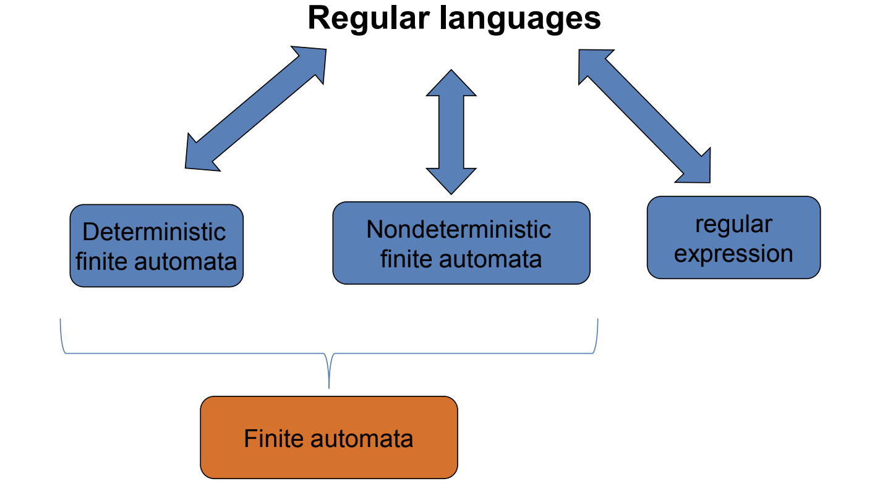
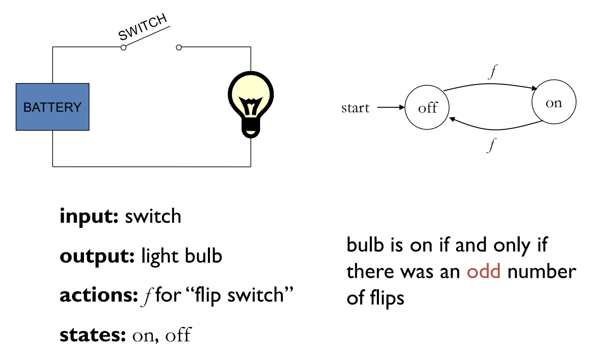
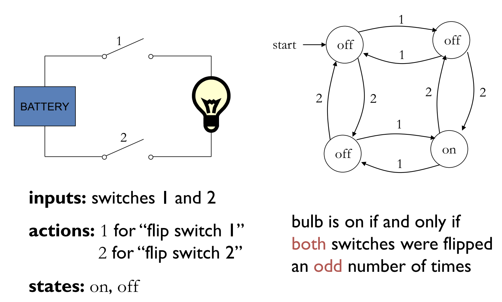
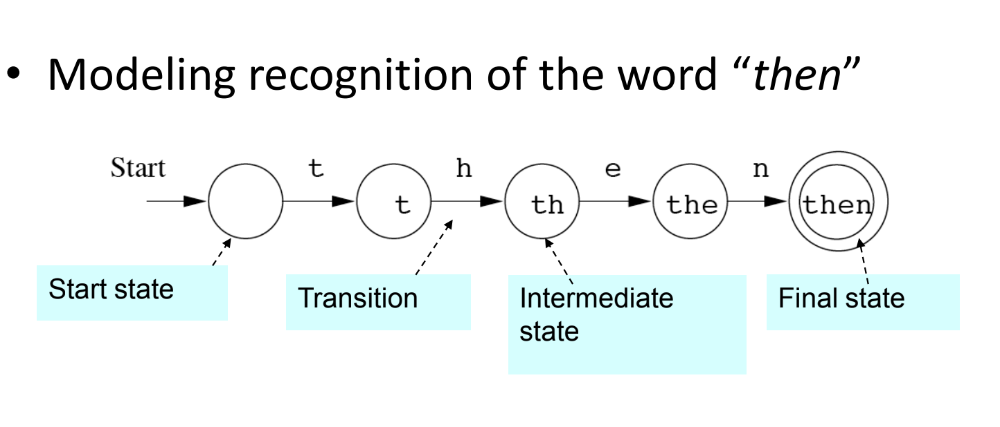
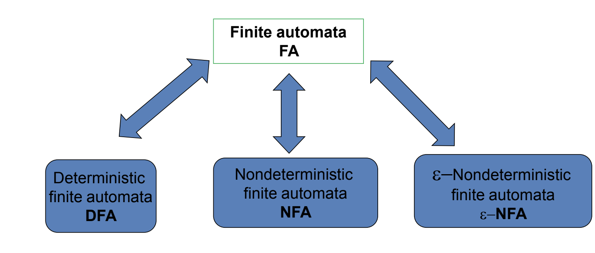
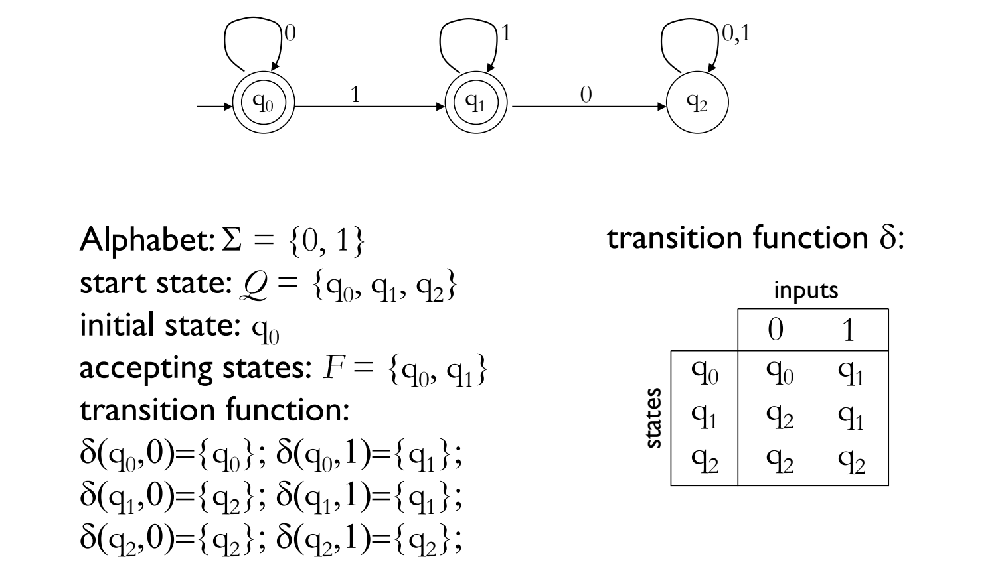
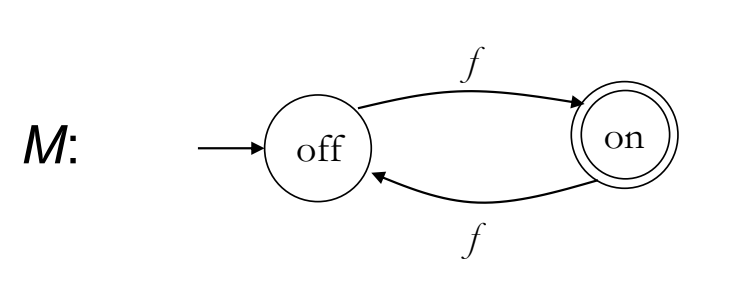
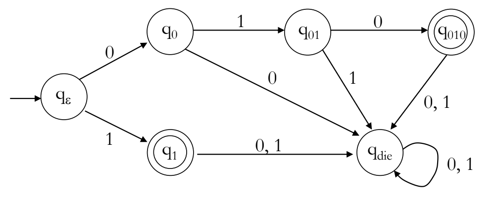
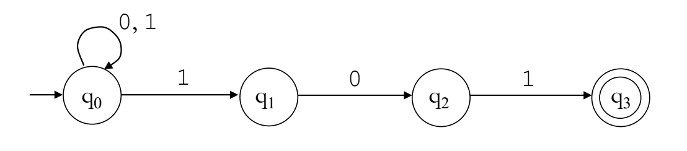
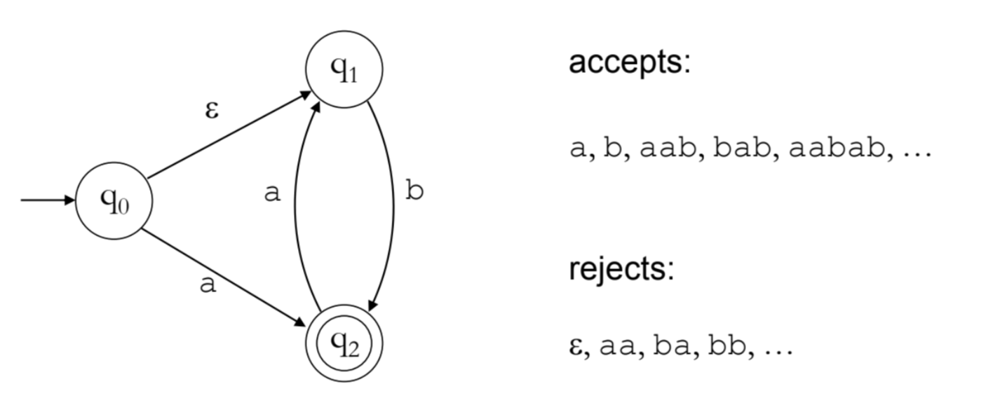

<h4 align="center">LFAF FCIM UTM </h4>
<h1 align='center'> 
░█▒░▒█▀▒▄▀▄▒█▀ 
▒█▄▄░█▀░█▀█░█▀
</h1>
<h4 align="center">Technical University of Moldova  </h4>
<h4 align="center">FCIM   |   UTM   |   Spring 2023</h4>

                           
  

 
  
p. Formal Languages & Finite Automata

  
c. I. Cojuhari  
lab. V. Drumea

 
  
Chisinau 2023

 
<h3><b> Course grading: </b></h3>

- Laboratories tasks 15%
- Individual work tasks 15%
- Mid-term evaluation (2) 15+ 15%
- Final exam 40%
  

  
c. LFAF | FCIM UTM Spring 2023 | 3-104 | 08.02.2023

<h2> Important </h2>

<table>
<tr>
<td><b> Sign</b> </td>
<td><b> Name</b> </td>
<td><b> Exemple</b> </td>
</tr>
<tr>
<td>&#8512;</td>
<td>alfabet</td>
<td>&#8512;={0,1}</td>
</tr>
<tr>
<td></td>
<td>string</td>
<td>010101010</td>
</tr>
<tr>
<td>&epsilon;</td>
<td>empty string</td>
<td>⅀ = ε <i>or</i> |w|=0 <i>or</i> w=ε </td>
</tr>
<tr>
<td>w</td>
<td>length</td>
<td>|w|=3</td>
</tr>
<tr>
<td>G</td>
<td>grammar</td>
<td></td>
</tr>
<tr>
<td>VT</td>
<td>finite set of<b> non-terminal symbols</b> </td>
<td rowspan="2">VT &#8745; VT = &#248;</td>
</tr>
<tr>
<td>VN</td>
<td>finite set of<b> terminal symbols</b> </td>

</tr>
<tr>
<td>S</td>
<td>start symbol;</td>
<td></td>
</tr>
<tr>
<td>P</td>
<td>is a finite set of productions of rules</td>
<td></td>
</tr>
<tr>
<td>CS</td>
<td>Context-Sensitive</td>
<td></td>
</tr>
<tr>
<td>CF</td>
<td>Context-Free</td>
<td></td>
</tr>

</table>
 

 

- **Language** - a means of communicating information, by using visual or audio interpretations of words.
- **Formal language** -  a set of strings based on an alphabet that are generated with the help of a grammar.
- **String** - a combination of symbols generated with the help of rules from the production set.
- **Grammar** - an entity defined by four elements: the set of non-terminal symbols, the set of terminal symbols, the start symbol, and the set of production rules.
- **Automation** - an abstract computational device. It contains the states, an alphabet, transition functions for each state, the initial and final states / a mathematical model of a finite-state machine. The state machine is a machine, which is having a set of input symbols, is jumping through the set of states, based on the transition functions.
- **Finite automaton** - an automaton with finite amounts of states and transitions.
- **Abstract machine** are (simplified) models of
real computations .

  

<h2 align="center">Powers of an alphabet</h2>

- If  ⅀ is an alphabet, we can express the set of all strings of a
certain length from that alphabet by using an exponential
notation.
- ⅀k is defined to be the set of strings of length <b>k</b>, each of
whose symbols is in ⅀.
  - ⅀0 = { ε }
  - ⅀1 = { 0, 1, 2 }
  - ⅀2 = { 00, 01, 02, 10, 11, 12, 20, 21, 22 }
  - ⅀3 = { 000, 001, 002, ... 222 }
- The set of words over an alphabet ⅀ is denoted
by ⅀&#42; &nbsp;&nbsp;&nbsp;&nbsp;&nbsp;&nbsp;&nbsp;&nbsp;&nbsp;&nbsp;&nbsp; ⅀&#42;  = { a1, ... an | a1, a2, ... an &#8712; ⅀ , n &#8805; 0 } 
- The set of nonempty words over ⅀ is denoted by
 &nbsp;&nbsp;&nbsp;&nbsp;&nbsp;&nbsp;&nbsp;&nbsp;&nbsp;&nbsp;&nbsp; ⅀+  = ⅀&#42; / { ε } 
- The concatenation of the word w1
and w2
is
denoted by<b><i> w1w2</i></b>
 &nbsp;&nbsp;&nbsp;&nbsp;&nbsp;&nbsp;&nbsp;&nbsp;&nbsp;&nbsp;&nbsp; w1 = 01, w2 = 11 -> w1w2 = 0111 ,  w2w1 = 1101
- A notation we will commonly use to define languages is by a
“set-former”:
  &nbsp;&nbsp;&nbsp;&nbsp;&nbsp;&nbsp;&nbsp;&nbsp;&nbsp;&nbsp;&nbsp;
 L={ w | something about w }
  

<h2 align="center">Grammar</h2>
A grammar G is an ordered quadruple
G=(VN
, VT
, P, S) 

EXAMPLE:

-  Let G = (VN
, VT
, S, P),
- where VN
= {S, A}
-  VT
= {a},
- S is a start symbol
- P = {S → aS, S → a}. 
  &nbsp;&nbsp;&nbsp;&nbsp;&nbsp;&nbsp;&nbsp;&nbsp;&nbsp;&nbsp;&nbsp;
 S → aS → <b>a</b>aS → <b>aa</b>aa → <b><i>stop</i></b> 
   &nbsp;&nbsp;&nbsp;&nbsp;&nbsp;&nbsp;&nbsp;&nbsp;&nbsp;&nbsp;&nbsp;
  S → a → <b><i>stop</i></b> 
   &nbsp;&nbsp;&nbsp;&nbsp;&nbsp;&nbsp;&nbsp;&nbsp;&nbsp;&nbsp;&nbsp;
   S → aS → <b>a</b>aS → <b>aa</b>a → <b><i>stop</i></b> 
      &nbsp;&nbsp;&nbsp;&nbsp;&nbsp;&nbsp;&nbsp;&nbsp;&nbsp;&nbsp;&nbsp;
   S → aS → <b>a</b>aS → <b>aaa</b>S → <b>aaa</b>a | &#8730;

  
<h2 align="center">Chomsky Classification</h2>

- <b> Type 0</b>. Recursively enumerable languages.
  &nbsp;&nbsp;&nbsp;&nbsp;&nbsp;&nbsp;&nbsp;&nbsp;&nbsp;&nbsp;&nbsp;
Only restriction on rules: left-hand side cannot be the empty
string ( * Ø → ... . )
-  <b> Type 1</b>. Context-Sensitive languages - <i> Context-Sensitive (CS) </i>
rules.
- <b> Type 2</b>. Context-Free languages -<i> Context-Free (CF) rules </i>
- <b> Type 3</b>. Regular languages -<i> Non-Context-Free (CF) rules </i>
 &nbsp;&nbsp;&nbsp;&nbsp;&nbsp;&nbsp;&nbsp;&nbsp;&nbsp;&nbsp;&nbsp;
0 ⊇ 1 ⊇ 2 ⊇ 3
 &nbsp;&nbsp;&nbsp;&nbsp;&nbsp;&nbsp;&nbsp;&nbsp;&nbsp;&nbsp;&nbsp;
a ⊇ b meaning a properly includes b (a is a superset of b),
 &nbsp;&nbsp;&nbsp;&nbsp;&nbsp;&nbsp;&nbsp;&nbsp;&nbsp;&nbsp;&nbsp;&nbsp;&nbsp;&nbsp;&nbsp;
i.e. b is a proper subset of a or b is in a

                           
  

  
<h2 align="center">Types of Grammars -
Chomsky hierarchy of languages</h2> 

                           
  

- **Finite state** automata - Devices with a finite amount of memory. Used to model “small” computers.

- **Push-down** automata - Devices with infinite memory that can be
accessed in a restricted way. Used to model parsers, etc.

- **Turing Machines** -  Devices with infinite memory. Used to model any computer.

- **Time-bounded Turing Machines** - Infinite memory, but bounded running time Used to model any computer program that runs in a “reasonable” amount of time.

  
<h2 align="center">Derivation Trees</h2>
A derivation in the language generated by a
<b>grammar</b> can be represented graphically using an
ordered rooted tree, called a <b>derivation (or parse)
tree</b>:

- the <b>root</b> represents the starting symbol,
- <b>internal</b> represent nonterminals,
- <b>leaves</b> represent terminals, and
- the <b>children of a vertex</b> are the symbols on the
right side of a production, in order from left to
right, where the symbol represented by the
parent is on the left-hand side.

<i> Example:</i>

                           
  

  

<h2 align="center">Finite automata</h2>

                           
  

- Automata theory is the study of abstract computational devices (abstract state machine).
- Abstract machine are (simplified) models of real computations .
- Computations happen everywhere: On your laptop, on your cell phone, in nature, ...
  

<i>Abstract machine Example:</i>

                           
  
  

  

What is an finite automaton?

-  An automaton is a mathematical model of a finite-state machine. The state machine is a machine, which is having a set of input symbols, is jumping through the set of states, based on the transition functions.
  

<i>Finite Automata Example:</i>

                           
  

                           
  

  

<h2 align=center><i>
Deterministic finite automata <b>(DFA)</b></i></h2>

A deterministic finite automaton (DFA) is a 5-
tuple (Q, S, d, q0, F) where

- Q is a finite set of states
- S is an alphabet
- d: Q × S → Q is a transition function
- q0 &isin; Q is the initial state
- F &isin; Q is a set of accepting states (or final states).

 In diagrams, the accepting states will be
denoted by double loops

<i>Example:</i>

                           
  

 

Language of a DFA

The language of a DFA (Q, S, d, q0 , F) is the set of all strings over S that, starting from q0 and following the transitions as the string is read left to right, will reach some accepting state.

                           
  

 

<i>Example:</i>

• Construct a DFA that accepts the language -><b>
  L = {010, 1} ( S = {0, 1} )</b>

• Answer:

                           
  

 

<h2 align=center>Nondeterministic finite automaton <b> (NFA)</b></h2>

Each state can have zero, one, or more
outgoing transitions labeled by the same
symbol.

                           
  

• A nondeterministic finite automaton (NFA) is a 5-tuple (Q, S, d, q0 , F) where

- Q is a finite set of states
- S is an alphabet
- d: Q × (S ∪ {e}) → subsets of Q is a transition function
- q0 &isin; Q is the initial state
- F &isin; Q is a set of accepting states (or final states).

• Differences from DFA:
- transition function d can go into several states
- It allows e-transitions

 Language of an NFA

The NFA accepts string x &isin; S* if there is some path that, starting from q0  , leads to an accepting state as the string is read left to right.

The language of an NFA is the set of all strings that the NFA accepts.

 

 &epsilon;-transitions

These can be taken for free:

                           
  

<i>Example:</i>

                           
  

