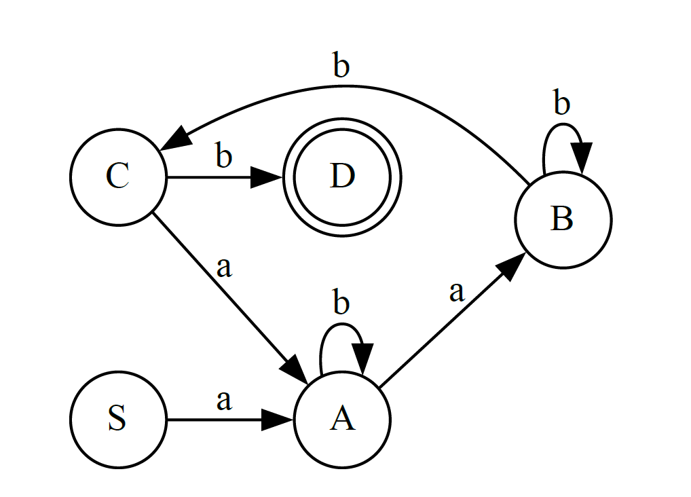
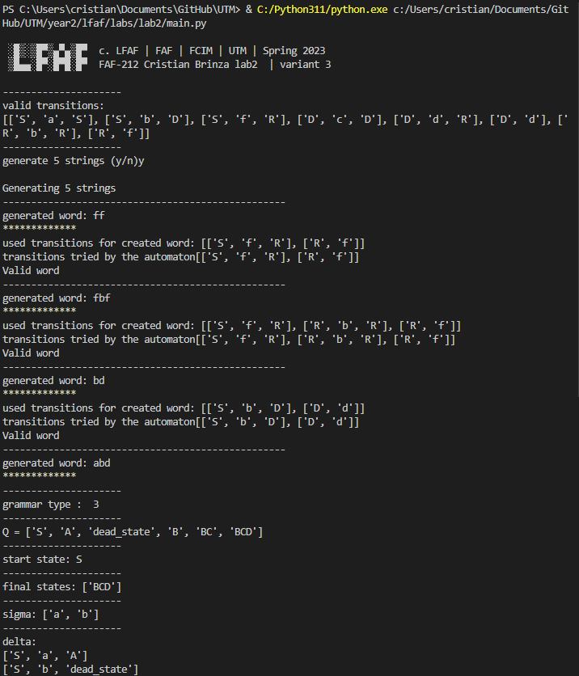

<h4 align="center">LFAF FCIM UTM </h4>
<h1 align='center'> 
░█▒░▒█▀▒▄▀▄▒█▀<br>
▒█▄▄░█▀░█▀█░█▀
</h1>

<h3 align="center" >Course: Formal Languages & Finite Automata</h3>
<h1 align="center">Intro to formal languages. Regular grammars. Finite Automata.</h1>
<h4 align="center">Technical University of Moldova  </h4>
<h4 align="center">FCIM   |   UTM   |   Spring 2023</h4><br><br>


<p align=center>                           
  
</p>
</br><p align=right>  
p. Formal Languages and Finite Automata
</p>
<p align=right>  
lab. V. Drumea
</p>
<p align="right" > student FAF-212, Cristian Brinza</p>
</br><p align=center>  
Chisinau 2023
</p>
<hr></br></br></br>

<h1 align='center'> 
Laboratory work nr. 2
</h1>

<p align="center"><i>my variant : </i><b> Variant 3</b></p>

```
VN={S, D, R}, 
VT={a, b, c, d, f},
P={ 
    S → aS
    S → bD
    S → fR
    D → cD
    D → dR
    R → bR
    R → f
    D → d
}

Given that:
AF = (Q,∑,δ,q0,F)

Q = {q0,q1,q2,q3,q4},
∑ = {a,b},
F = {q4},
δ(q0,a) = q1,
δ(q1,b) = q1,
δ(q1,a) = q2,
δ(q2,b) = q2,
δ(q2,b) = q3,
δ(q3,b) = q4, 
δ(q3,a) = q1.
```


## Objectives:
1. Understand what an automaton is and what it can be used for.

2. Continuing the work in the same repository and the same project, the following need to be added: a. Provide a function in your grammar type/class that could classify the grammar based on Chomsky hierarchy.

     - For this you can use the variant from the previous lab.

3. According to your variant number (by universal convention it is register ID), get the finite automaton definition and do the following tasks:
    - a. Implement conversion of a finite automaton to a regular grammar.
    - b. Determine whether your FA is deterministic or non-deterministic.
    - c. Implement some functionality that would convert an NDFA to a DFA.
    - d. Represent the finite automaton graphically (Optional, and can be considered as a bonus point):

4. You can use external libraries, tools or APIs to generate the figures/diagrams.

5. Your program needs to gather and send the data about the automaton and the lib/tool/API return the visual representation.
<br><br>

## Screenshots :

<p align=center>                           
  
</p>
<br>
<p align=center>                           
  
</p>
<br><br>

## Implementation description

<br>
<div class="markdown prose w-full break-words dark:prose-invert light"><p>This program defines a class called <code>FiniteAutomata</code>. It provides the methods to check if a given word is accepted by the automaton, convert the automaton to a regular grammar, determine if the automaton is a DFA or a NFA, convert a NFA to a DFA, and display the finite state machine.</p><p>It imports two libraries, <code>grammar</code> and <code>graphviz</code>.</p><p>The <code>__init__</code> method initializes the instance variables, including <code>q0</code>, <code>F</code>, <code>sigma</code>, <code>delta</code>, and <code>Q</code>. <code>q0</code> is the initial state, <code>F</code> is the set of final states, <code>sigma</code> is the input alphabet, <code>delta</code> is the transition function, and <code>Q</code> is the set of states.</p><p>The <code>checkWord</code> method takes a word as input and returns <code>True</code> if the word is accepted by the automaton, <code>False</code> otherwise. It checks if the first state of the word is in the initial state, if the last state of the word is in the final state, and if all the letters of the word are in the alphabet. It computes the transitions made by the automaton for the given word and prints them.</p><p>The <code>convertGrammar</code> method converts the automaton to a regular grammar. It initializes a dictionary to store the productions of the grammar, creates the regular grammar from the dictionary of productions, and returns the regular grammar.</p><p>The <code>automatonType</code> method determines if the automaton is a DFA or a NFA. It iterates over each state of the automaton and checks if the inputs for that state are unique and cover the entire input alphabet. If they are, the automaton is a DFA, otherwise it is a NFA.</p><p>The <code>nfa_to_dfa</code> method converts a NFA to a DFA. It creates two arrays to store the transitions and states of the DFA. It iterates over each state of the NFA and generates the corresponding row for the DFA. It then generates the remaining rows of the DFA until no new states are generated. It initializes a list of final states and generates the transition function for the DFA. Finally, it returns the new DFA.</p><p>The <code>display</code> method displays the finite state machine using the <code>graphviz</code> library. It creates a new graph with the specified filename and direction, and specifies final states by double-circling them.</p></div>